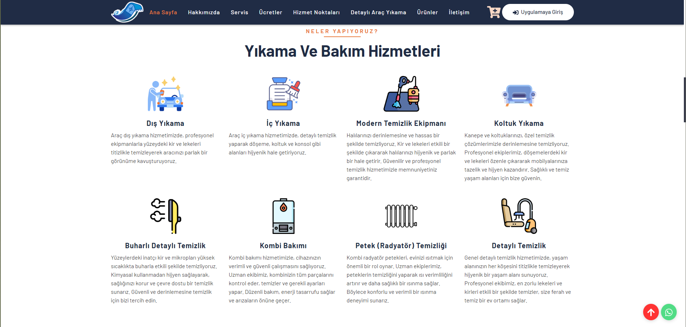
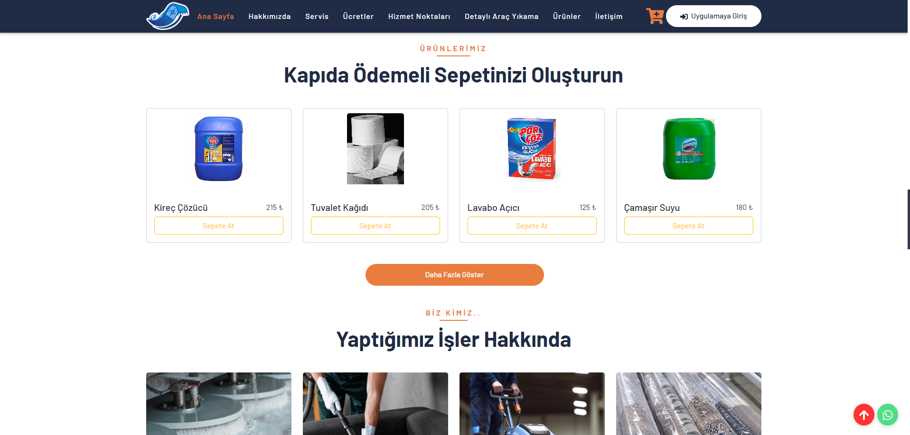
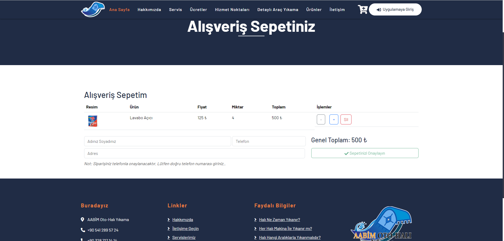
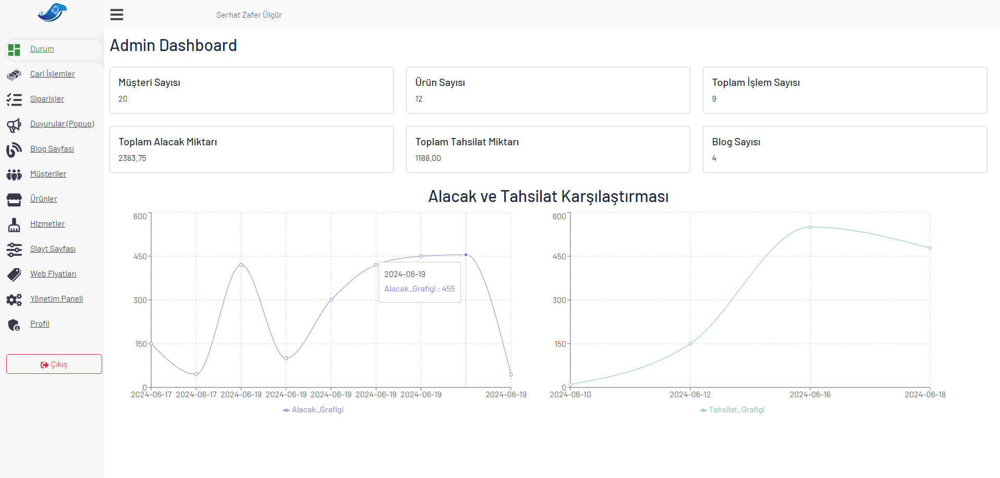
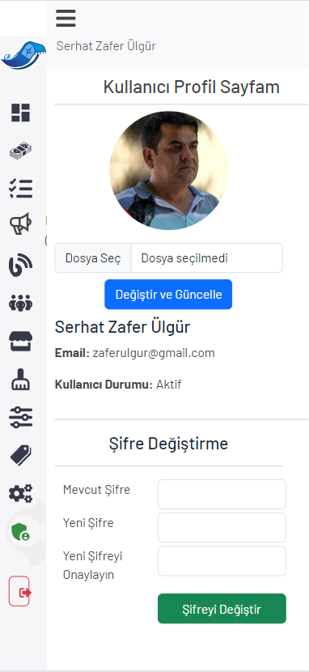

# Kullanılan Teknolojiler

## Frontend
-  ReactJS & RTK Query
-  PrimeReact
-  React-Icons
-  Bootstrap
- CSS

## Backend
-  NodeJS & ExpressJS

## Veritabanı
-  MariaDB

## Ekstralar
-  JsonWebToken
-  BcryptJS

Sitenin Ana Sayfası

Ara Sayfalar

Ara Sayfalar

Sepet Ekranı

Admin Sayfası

Mobil Ekran
